# Assessment Task 4  
By Yuna Shin

## **Identifying and Defining**
## Identifying a Need 
**Brainstorming:**
- Going around and finding water sources before your hp level runs out
- Walking around a town and completing simple tasks or missions from npc characters
- Going around a snowy town and collecting firewood and food before your hp levels run out
- Living in a simple town : design-based game
- Finding objects but in a 3D space

-----

**Need:**
To provide players with a calming and immersive experience to relieve themselves from their stress through exploration in a peaceful winter environment.

**Problem Statement:**
Many people experience stress, overstimulation or difficulty finding a moment of calm. This slow-paced exploration game set in a snowy landscape can promote relaxation as players gather firewood and light fires to stay warm.

**Skill Development:**
To develop the skills in Unity required to create the game, I would complete https://learn.unity.com/ and other tutorials from Youtube. 

## Requirements Outline 
**Inputs:**   
User inputs will include :  
- **Arrow keys or WASD** to move the player forward, backward, left and right
- **Spacebar** for jumping
- **Mouse clicks** to select buttons or interact with objects
- **Mouse movement** to look around the environment and control the camera view
- **Esc key** to open/close settings 
- **I key** to open or close inventory 

**Processing:**  
When the player provides an input, the processes will include:
- The program reads the key inputs and updates the player's position and rotation in the 3D environment
- Mouse input adjusts the camera angle 
- The mouse clicks are detected to interact with objects like firewood
- When an item is collected, the inventory is updated 
- The spacebar makes the player jump
- Pressing the Esc key open or closes the settings menu
- Pressing the I key opens or closes the inventory screen

**Outputs:**. 
When the player provides an input, the outputs will include:
- The game will update the player's position and rotation on screen based on movement inputs
- The camera view will change according to mouse movement, showing different angles of the environment
- Sounds and effects will play according to player movement and interactions
- Objects will respond visually when clicked
- The inventory panel will display collected items when opened
- The settings menu will display pause, unpause and quit when opened

**Transmission:**
- This game is a single-player experience

**Storage:**
- No data will be sent or received over the internet
- All actions, inventory and game stats are restarted and reset when the game is closed

## Functional Requirements
**User Interaction:**  
- The WASD or Arrow Keys allow the player to move forward, backward, left and right through the snowy environment
- Mouse movement controls the camera, letting the player look around smoothly. Mouse clicks are used to interact with nearby objects, such as collecting firewood 
- Pressing the spacebar makes the player jump to navigate the uneven terrrain. 
- The Esc Key opens or closes the settings menu, pausing the game 
- The I Key opens or closes the inventory, allowing the player to view collected items
- When the player interacts with an objects, the system responds by updating the inventory or playing sound effects

**Simulation Mechanics:**  
1. The player will move through a 3D snowy environment using keyboard and mouse inputs
2. The game simulates cold weather conditions, gradually decreasing the player's health level over time
3. The player must collect firewood from the environment by interacting with objects
4. Collected firewood will be used to build and light fires, whcih restore warmth and prevent the player's health from depleting
5. The game continuously updates the player's health and inventory based on actions and the environment
6. If the player's health reaches 0, the simulation resets representing that the character was overcome by the cold
7. All progress and stats are reset when the game is closed, allowing a fresh start

**Progress Tracking:**
- The game will track player progress through health and inventory levels
- Visual indicators such as health and warmth bars will be provided 
- Sound effects and visual cues will give feedback when a player interacts with objects
- If the player's health reaches 0, a message will appear to indicate the player has failed and must restart
- Progress will be temporary and will reset each time the game is closed or restarted

## Non-Functional Requirements
**Performance Requirements:**
- The game should load within 10 seconds
- Player movement and camera controls should respind instantly to kayboard and mouse inputs with no noticeable delay
- All interactions with objects should trigger immediate sound and visual cues
- The game environment should maintain stable performance and smooth visuals even when objects and particle effects (such as snow or fire) are active

**Usability Requirements:**
- The game will include a main menu screen with clear options to start, quit and view instructions
- The instructions section will explain the basic controls and the main objective of the game
- The user interface will be simple, with clear icons and readable text
- The overall design will ensure users can navigate th emenus and other game elements quickly and without confusion

**Scalability Requirements:**
- The game design should allow future expansion without reducing performance or stability
- Additional features could include the ability to collect and eat food, as well as to cook meals at the campfire to restore health faster
- Future updates could also introduce wild animals that players can interact with

## Consideration of Social and Ethical Issues
**Define the following terms:**  
1. Equity - the quality of being fair and just, expecially in a way that takes account of and seeks to address the existing inequalities
2. Accessibility - the quality of being able to be reached, enetered or used by people

**Accessibility:**  
The game will aim to be accessible to players of all abilities by providing clear visual cues, simple controls and easy-to-read text. The instructions will be displayed in a readable font and size to assist players with visual and auditory difficulties. Overall, the design will focus on simplicity and clarity to ensure that all users are able to enjoy and understand the gameplay experience.

**Privacy and Data Protection:**  
The game will not collect any personal information or user data. All gameplay including health, inventory and progress is stored temporarily in memory and resets when the game is closed. Since no data is saved locally or online, there are no privacy or data protection concerns for the players. 

**Fairness and Representation:**  
The game is designed to avoid stereotupe or bias as it focuses on survival and exploration in a snowy environment. The character does not have a specific gender, race or cultural background and all interactions and scenarios have no relation to do with identity. 

**Mental and Emotional Well-Being:**  
The game promotes a calm and relaxing experience for players. The snowy environment, gentle visuals and slow-paced gameplay encourages mindfulness and reduces stress. By focusing on exploration, collecting resources and maintaining warmth, the game provides a soothing and positive experience without any violent or distressing content.

**Cultural Sensitivities:**  
The game avoids content that could be offensive to different cultures by focusing on a neutral snowy environment wihtout references to specific religions, traditions or cultural symbols. All gameplay revolves around exploration, survival and resource collection, ensuring that all players from any background can enjoy the game wihtout encountering inappropriate or culturally sensitive material.

## **Researching and Planning**
## Exploration of Existing Ideas
| Existing Idea | Plus | Minus | Implication | 
|----------|----------|----------| -------- | 
| 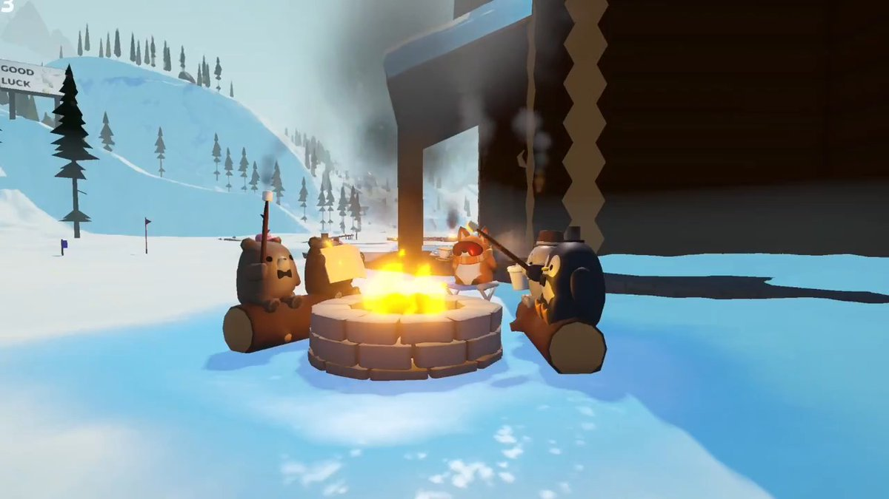 Sledding Game  | The sledding game creates a fun and engaging sense of speed and movement through a snowy environment. The visuals are appealing and there a smooth animations and a realistic snow physics that makes the game play feel immersive. The excitement of sliding down hills gives players a clear and simple objective, making it easy to to pick up and play. | The game is very focused on action and competition, which limits its relazing potential. Some aspects are very fast-paced, offering little opportunity for exploration and creativity. There is also a minimal interaction in interacting with objects or the obstacles, which can make it seem less meaningful for players seeking a calm game. | For may game, I will focus less on spead and competition and more on creating an interactive experience that envourages exploration and mindfulness. I can take inspiration from the strong visuals and smooth physics for realism but avoid the repetitive and fast gameplay. | 
| 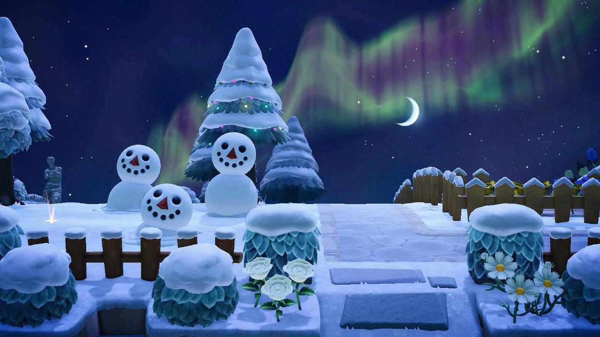 Animal Crossing | Animal crossing creates a peaceful and engaging environment where players can relax, explore and express their creativity. The game allows players to interact with nature, collect resources and build relationships with friendly characters, which helps to create a strong sense of calm. Its gentle music, soft visuals and open-ended gameplay makes it an inviting expereince that encourage players to play at their own pace. | While the game may offer a peaceful environment, it can become repetitive over time because of its fixed daily routines, time-based progresion and the dependance on social interactions. These features may fustrate those who prefer freedeom and independance. The game's structured nature makes it feel less relaxing for those who simply wanto to explore or unwind at their own pace. | For my game, I will keep the calm and creative atmosphere that Animal crowwing does well but avoid the time restrictions and social dependancies. PLayer will be free to explore, collect resources and build fires without pressure or other external goals. This will make the experience more personal and meditative, appealing to those who enjoy calm, solitary gameplay. | 
|  A Short Hike | A short hike does an excellent job of simple exploration. It encourages players to wander freely, interact with other characters and enjoy the peacefulness of nature withou feeling rushed. The visuals are stylized and the relaxing music enhances the sense of calm and disovery. The game creates a short but meaningful experience. | The game is relatively short in the length and lacks replayability once the main goal is achieved. While the freedom to explore is enjoyable, there are limited mechanics or evolving challenges to keep players engaged over time. The focus on dialogue and interaction with other characters may also not appeal to players who prefer quieter, more solitary experiences. | For my game, I can take inspiration from the sense of freedom, calm tone and natural setting while expanding on the longetivity of the game. I can maintain the peaceful exploration and gentle atmohsphere but indluce ongoing survival elements like collecting firewood, making fires and managing warmth. My game will be more solitary and meditative, offering a continuous epxerience encouraging mindfulness rather than conversation or story progression. | 

## Flowchart
**Player Movement and Jumping**
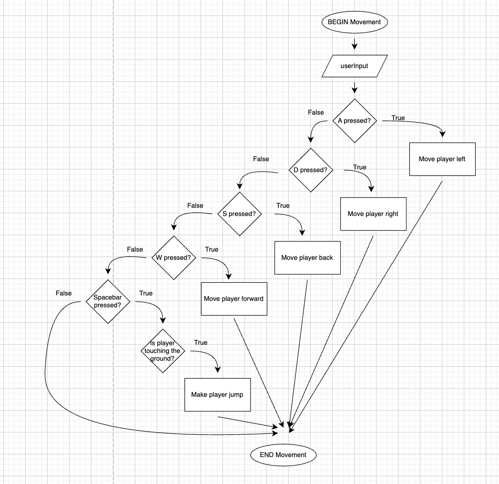

**Camera Control**
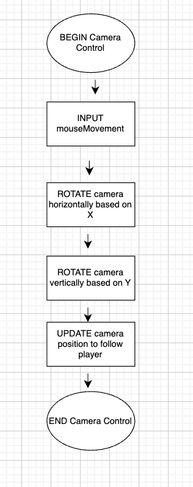

**Object Interaction**
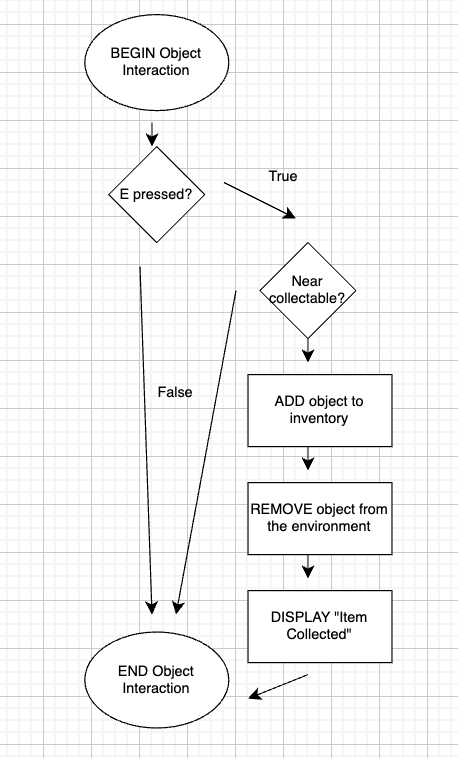

**Inventory System**
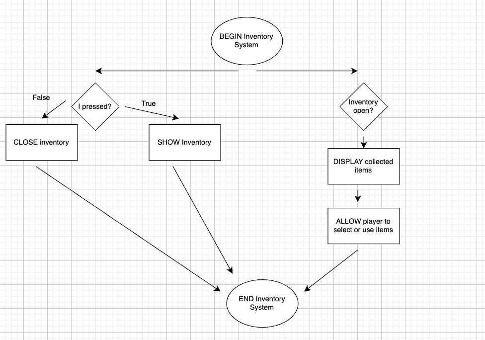

**Fire-Making**
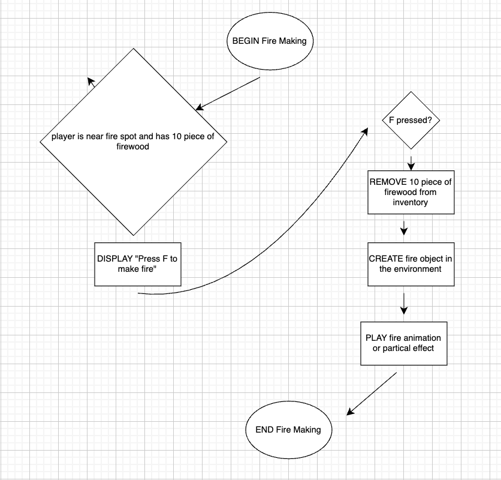

**Health System**
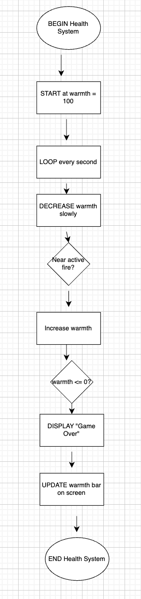

**User Interface**
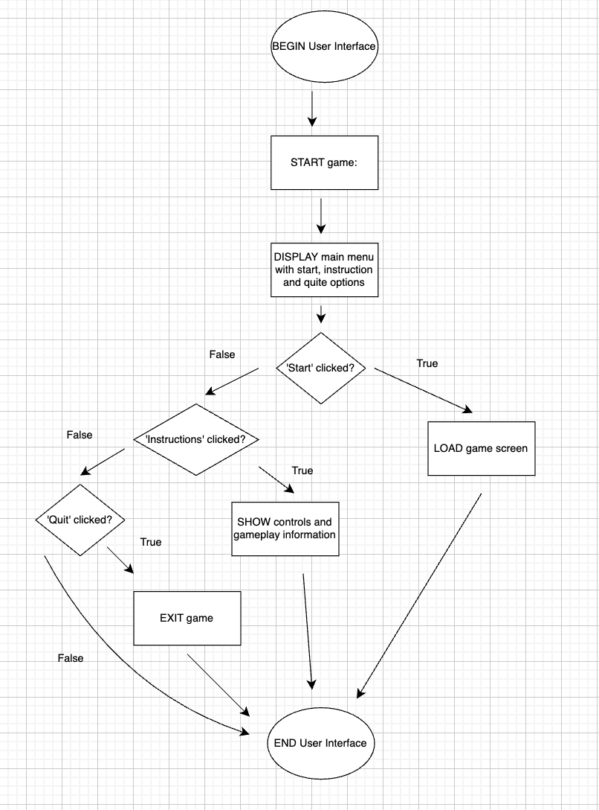

**Pause and Settings Menu**
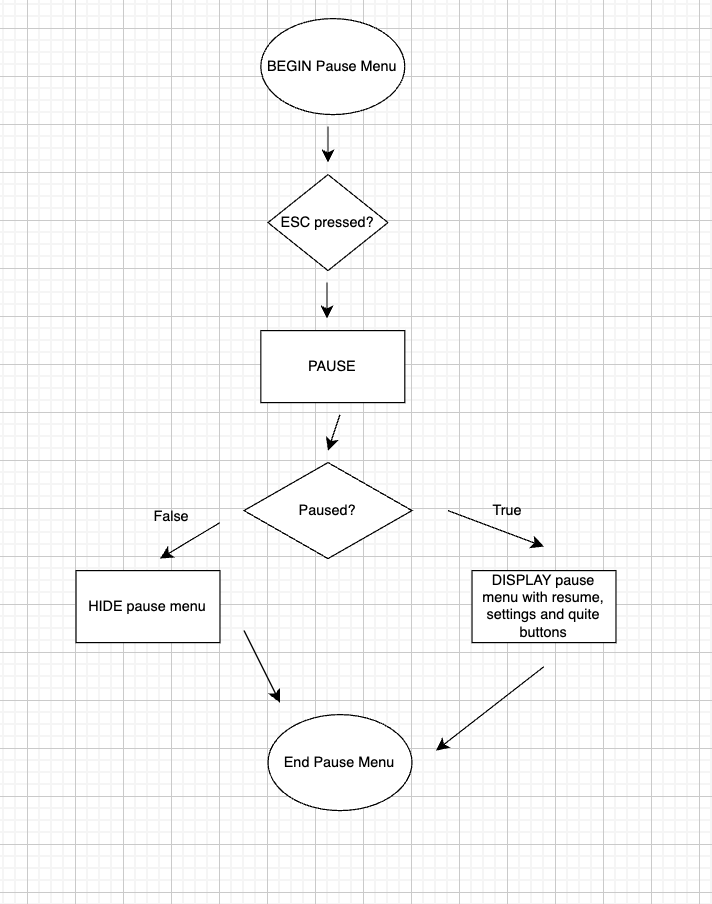

## Pseudocode
**Player Movement and Jumping**

**Camera Control**
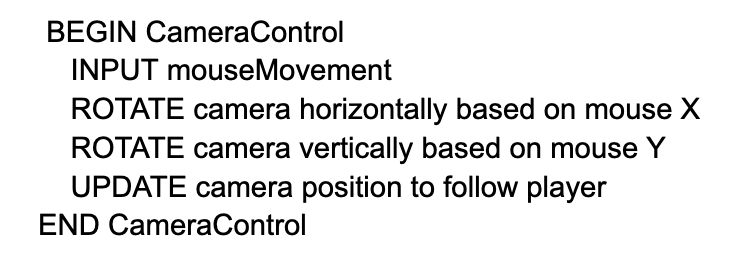

**Object Interaction**
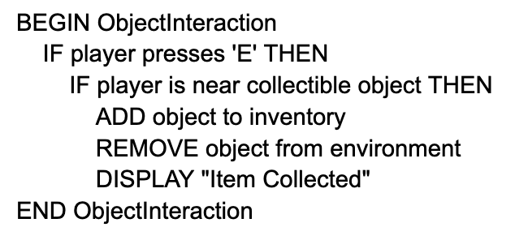

**Inventory System**
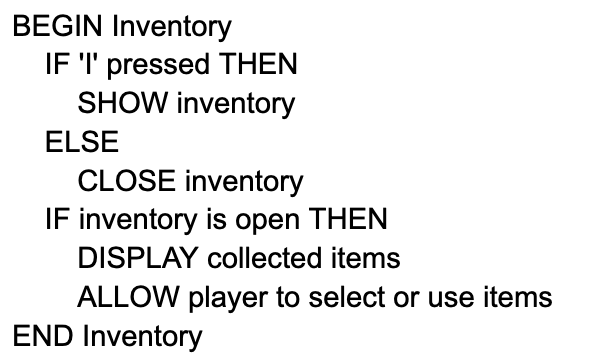

**Fire-Making**
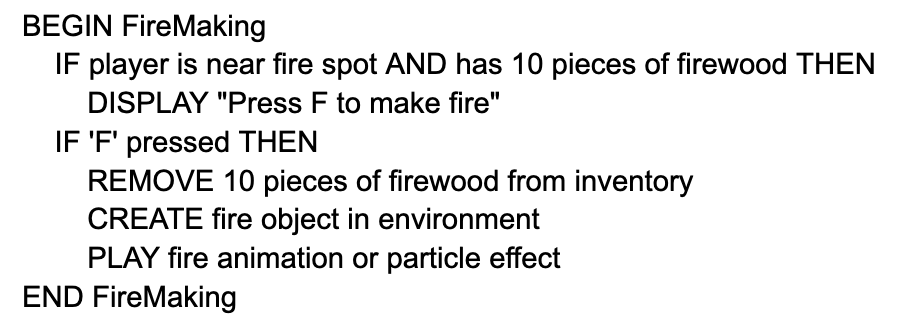

**Health System**
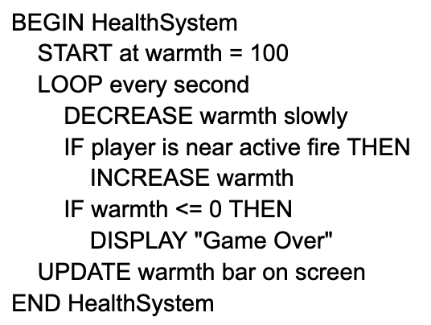

**User Interface**
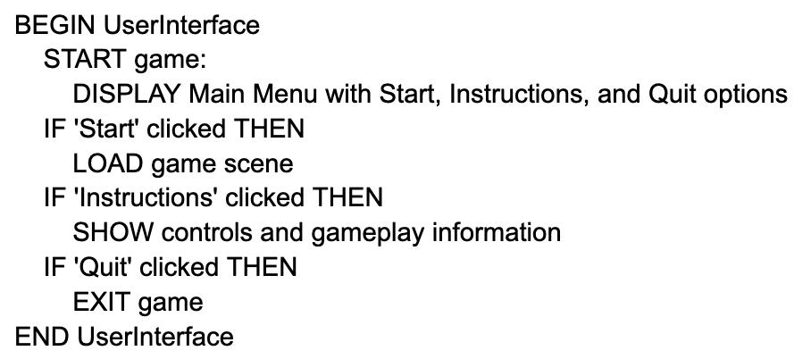

**Pause and Settings Menu**
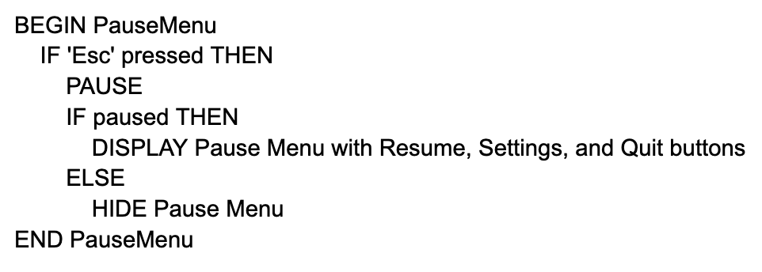

## Storyboards
**Start Screen**
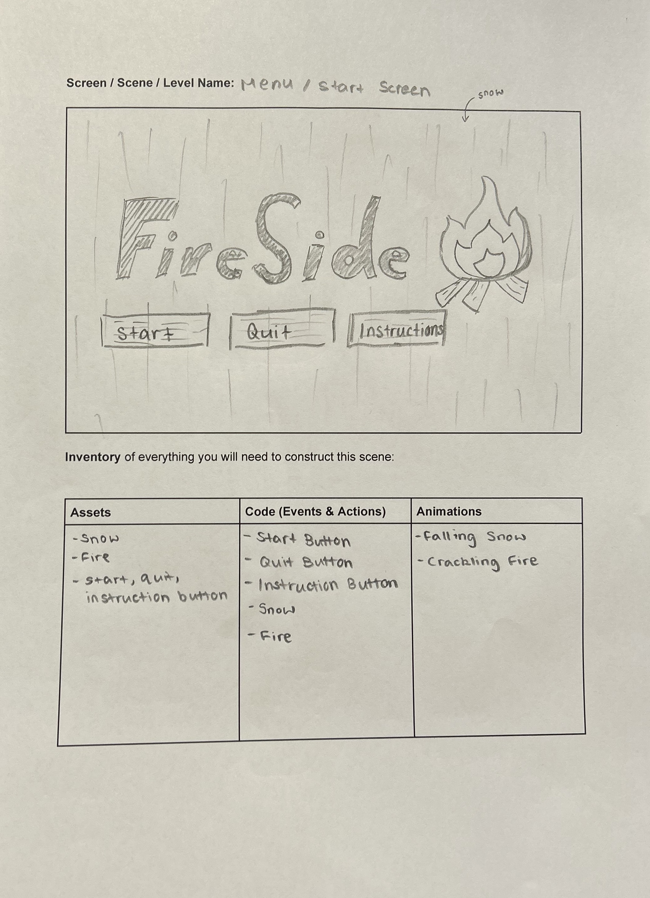

**Background**
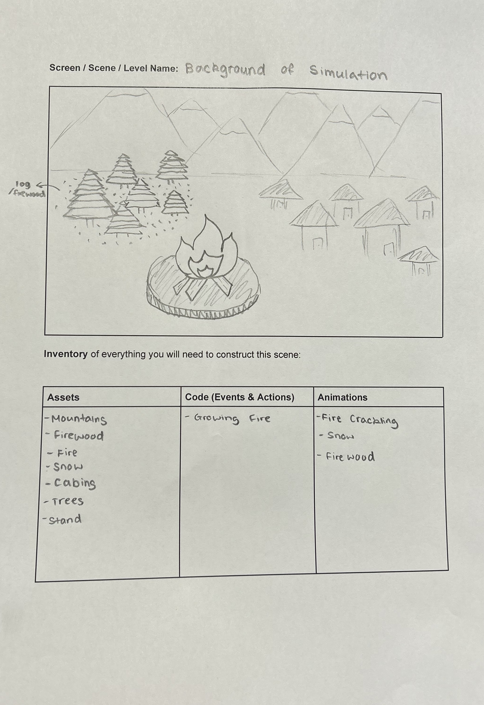

**Flowchart**
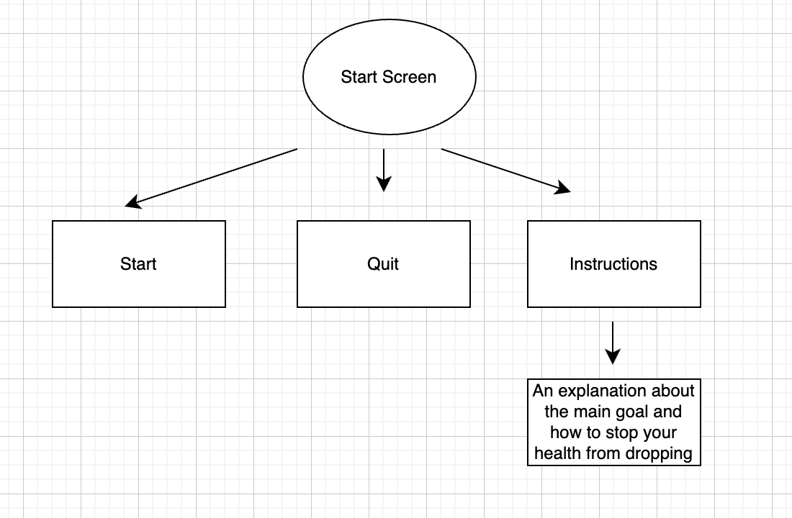

## Gantt Chart

https://docs.google.com/spreadsheets/d/1pOqH3sIC76ER3WUtvBrtCD8UY9baDhqnpTJXwNJjB_w/edit?gid=0#gid=0 